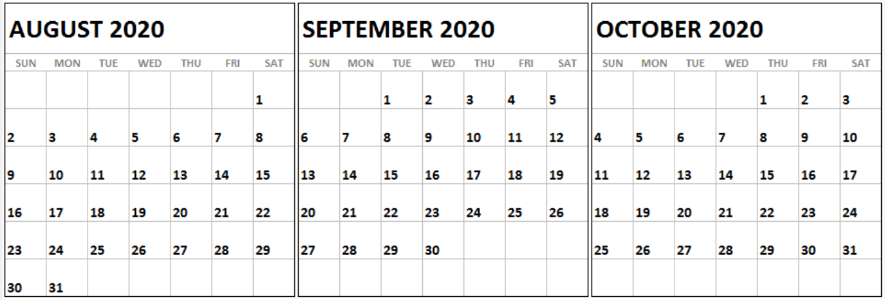

---
layout: default
---

One stop shop for latest information...

 

* * *

* * *

 

### Important Dates:

* Aug 04:  &ensp; Freshmen “pick-up” at CHS to receive Cen10 T-shirt/Chromebook  
* Aug 12: &ensp; Student schedule will be viewable on HAC
* Aug 13: &ensp; First day of school (Thur) - virtual
* Aug 21: &ensp; No school (Fri)
* Aug 28: &ensp; No school (Fri)
* Sep 03:  &ensp; First day of in-person on-campus classes. Come to school for one day, then have a 4-day weekend, and then return to face-to-face school on Sept 8
* Sep 04: &ensp; No school (Fri)
* Sep 07: &ensp; No school (Mon - Labor Day)
* Sep 08: &ensp; Normal School
* [Latest School Calendar](https://www.friscoisd.org/docs/default-source/frisco-isd-calendars/2020-21-school-calendar.pdf?sfvrsn=4)
                           

 

### Important Football Dates:

<b>Freshman Conditioning:<b/>
* Aug 03: &ensp;  8:30-10:30 AM
* Aug 04:  &ensp;  8:30-10:30 AM
* Aug 05, 06, 07: &ensp; 6:15-8:15 AM
* Aug 10, 12, 13: &ensp;  6:15-8:15 AM

 

### Freshman Orientation:

*   [update](https://www.smore.com/a21mj-camp-cen10-freshmen-orientation?ref=email)

 

### Latest CHS News and Information Newsletter:

*   [newsletter](https://www.smore.com/euq6d-chs-news-and-information)

 

### Education:

*   [Centennial H.S. main page](http://schools.friscoisd.org/campus/high-school/centennial/home)
*   [Centennial H.S. main links](http://schools.friscoisd.org/campus/high-school/centennial/home)
*   [Bell Schedule](files/bell.txt)
*   [HAC](https://hac.friscoisd.org/HomeAccess/Account/LogOn?ReturnUrl=%2fhomeaccess%2f)
*   [Canvas](https://fisd.instructure.com/)
*   [FISD Academic Guide](https://github.com/tombresee/Cen10/raw/master/files/2020-21-academic-guide-and-course-catalog.pdf)
*   [2020-21 Virtual Course Offerings](https://www.friscoisd.org/departments/covid-19/virtual-instruction/2020-21-course-offerings)
*   [School Cafe](https://www.schoolcafe.com/)
*   [Technology Quick Reference Sheet](https://www.smore.com/app/reporting/out/euq6d?u=https%3A%2F%2Fdocs.google.com%2Fdocument%2Fd%2F1oAmbn5sJW-sdFqOaiFOAAMnNw8fGEU54N5GA4o6Ih-c%2Fedit%3Fusp%3Dsharing&t=https://docs.google.com/document/d/1oAmbn5sJW-sdFqOaiFOAAMnNw8fGEU54N5GA4o6Ih-c/edit?usp=sharing&w=w-5947685056&i=&l=l-5548263445) - GoogleDoc references for both in-person and virtual courses at CHS
*   [CHS Newsletters](https://sites.google.com/friscoisd.org/chsnewsletter/home?authuser=0)
*   [list of contacts](https://docs.google.com/spreadsheets/d/1NILBiUV8CoBHkHVWDDWDX3VjIji_NKPyGJM1KycXVts/edit#gid=0)

 

### FISD Tech Support: 

*  [Tech Support](https://fisd.instructure.com/courses/53785)
*  [Student Toolbox](https://sites.google.com/friscoisd.org/student-toolbox/home)
*  [Technologies](files/access.png)

 

### Sports:

*  [Master FISD Sports Schedule](http://www.friscoisd.org/calendar/frisco-isd-athletics-calendar#allsports)
*  [Main CHS Athletics](https://www.gocentennialtitans.com/)
*  [Football Schedules](https://www.gocentennialtitans.com/sport/football/boys/) - *being updated*
*  [Ford Center](https://www.thestarinfrisco.com/ford-center/)

 

### Clubs:

*  [clubs list](https://docs.google.com/document/d/19OKm_GTjrc_0ccd7UIu5TzPx6mpJ88zHF2vC6-bjj3g/edit) 

 

### Student Computer Request Form:

*   [form](https://docs.google.com/forms/d/e/1FAIpQLSfokvCjuUkinTYuwmn9gCTVpVX24B-i5n7zwf81HyDilIhKjw/viewform)

 

### Social Media:

*   [Centennial - FB](https://www.facebook.com/Cen10titans/)
*   [@Cen10Titans - TW](https://twitter.com/cen10titans?lang=en)
*   [@Cen10 News - TW](https://twitter.com/Cen10News)
*   [@Centennial Wrestling - TW](https://twitter.com/cen10wrestling?lang=en)
*   [@SOCfisd - TW](https://twitter.com/socfisd) - Student Opportunity Center
*   [@CHSTitanNation - TW](https://twitter.com/CHSTitanNation)

 

### Phone Apps:

*  [Master FISD Sports Schedule](http://www.friscoisd.org/calendar/frisco-isd-athletics-calendar#allsports)
*  [Main CHS Athletics](https://www.gocentennialtitans.com/)
*  [Football Schedules](https://www.gocentennialtitans.com/sport/football/boys/) - *being updated*

 

### FISD.org:

*   [FISD friscoisd.org](https://www.friscoisd.org/)
*   [FISD Depts](https://www.friscoisd.org/departments)
*   [FISD Students](https://www.friscoisd.org/students)
*   [Student Portal](https://portal.friscoisd.org/LoginPolicy.jsp)
*   [Student Portal](https://portal.friscoisd.org/secure/SecureCloudAccessProfile/FinishLogin.jsp)

 

### Floor Plan for Centennial High:

*   [pdf](files/floorplan.pdf)

 

### Safety:

*   [COVID FISD FAQ](https://www.friscoisd.org/departments/covid-19/coronavirus)
  * [H.S. Protocol](https://docs.google.com/document/d/e/2PACX-1vRJw0oRCNzjS5w4qpQjZe1MMVM0nLfJzXm31PkExwcamNHjeRDu32WDnS-iWeixE3irHBeBEOdlp-TY/pub)

 

### Submitting Community Service Hours:

Students wishing to submit documentation for the district’s community service recognition program must do so by the end of each school year; hours accrued during the summer months may be submitted the following school year. Students who submit at least 100 hours of properly documented, eligible activities to their Xello account by April 1 of their Senior year will receive a recognition cord for graduation. Xello is accessed via a tile in the Student Portal. Students are encouraged to identify eligible activities prior to completing hours; this information is available on p. 37 of the [FISD Academic Guide](https://www.smore.com/app/reporting/out/euq6d?u=https%3A%2F%2Fwww.friscoisd.org%2Fdocs%2Fdefault-source%2Fresources-information%2F2020-21-academic-guide-and-course-catalog.pdf%3Fsfvrsn%3D4&t=FISD%20Academic%20Guide&w=w-4545837832&i=&l=l-5463440625). To help you plan ahead: contact information for an adult (other than the student’s parent) supervising the activity is required for this submission.
* [community service ref sheet](https://docs.google.com/document/d/12DlosmmYYMzcO5iEix6qwFR1T_IJZe8fYKEWRYz9OX4/edit)

 

### ToDo:

* install ms office 365 entities [link](http://www.friscoisd.org/departments/technology-and-media-services/office-365)
* https://docs.google.com/document/d/1oAmbn5sJW-sdFqOaiFOAAMnNw8fGEU54N5GA4o6Ih-c/edit#
* online training 45 min class https://fisd.instructure.com/enroll/PKY4R4
* peruse http://schools.friscoisd.org/campus/high-school/centennial/home
* [tour I](https://drive.google.com/file/d/1hP2D1l0hTr_DvnLYgyd-X4OnBuuidIv9/view)
* [tour II](https://drive.google.com/file/d/1prgkMIoaxROyhGCTrVNTa6kia3hrBgHM/view)
* [tour III](https://drive.google.com/file/d/1mkv1ayOO0r9rnA9iAnSaKoXZ3zgmbLOi/view)

     

